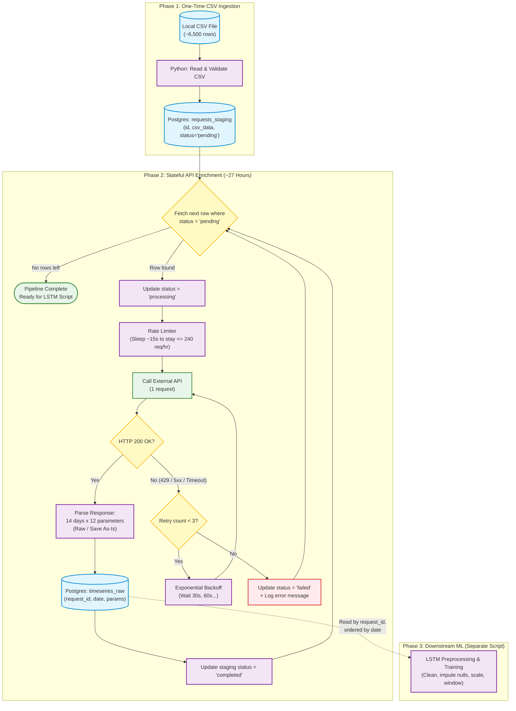

# ETL & LSTM Data Pipeline

```mermaid
flowchart TD
    %% Styling
    classDef storage fill:#e1f5fe,stroke:#0288d1,stroke-width:2px;
    classDef process fill:#f3e5f5,stroke:#7b1fa2,stroke-width:2px;
    classDef decision fill:#fff9c4,stroke:#fbc02d,stroke-width:2px;
    classDef external fill:#e8f5e9,stroke:#388e3c,stroke-width:2px;
    classDef error fill:#ffebee,stroke:#d32f2f,stroke-width:2px;

    %% Phase 1: Initial Load
    subgraph Phase1 ["Phase 1: One-Time CSV Ingestion"]
        A[("Local CSV File<br/>(~6,500 rows)")]:::storage --> B["Python: Read & Validate CSV"]:::process
        B --> C[("Postgres: requests_staging<br/>(id, csv_data, status='pending')")]:::storage
    end

    %% Phase 2: Rate-Limited Enrichment Loop
    subgraph Phase2 ["Phase 2: Stateful API Enrichment (~27 Hours)"]
        C --> D{"Fetch next row where<br/>status = 'pending'"}:::decision
        D -- "No rows left" --> Z(["Pipeline Complete<br/>Ready for LSTM Script"]):::external
        D -- "Row found" --> E["Update status = 'processing'"]:::process
        E --> F["Rate Limiter<br/>(Sleep ~15s to stay <= 240 req/hr)"]:::process
        F --> G["Call External API<br/>(1 request)"]:::external
        G --> H{"HTTP 200 OK?"}:::decision

        %% Success Path
        H -- "Yes" --> I["Parse Response:<br/>14 days x 12 parameters<br/>(Raw / Save As-Is)"]:::process
        I --> J[("Postgres: timeseries_raw<br/>(request_id, date, params)")]:::storage
        J --> K["Update staging status = 'completed'"]:::process
        K --> D

        %% Error / Retry Path
        H -- "No (429 / 5xx / Timeout)" --> L{"Retry count < 3?"}:::decision
        L -- "Yes" --> M["Exponential Backoff<br/>(Wait 30s, 60s...)"]:::process
        M --> G
        L -- "No" --> N["Update status = 'failed'<br/>+ Log error message"]:::error
        N --> D
    end

    %% Phase 3: Downstream ML
    subgraph Phase3 ["Phase 3: Downstream ML (Separate Script)"]
        J -. "Read by request_id,<br/>ordered by date" .-> O["LSTM Preprocessing & Training<br/>(Clean, impute nulls, scale, window)"]:::process
    end
```